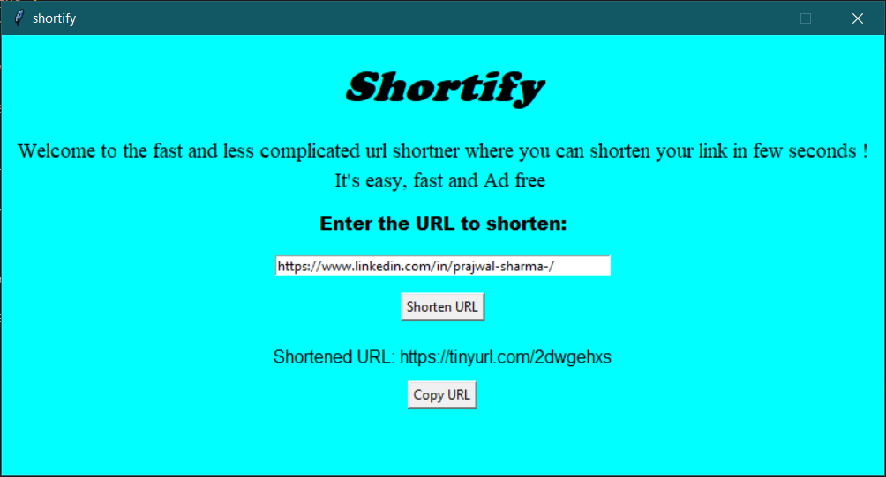

# Shortify
Shortify is a simple URL shortener application programmed in Python. It utilizes the [Tkinter](https://docs.python.org/3/library/tkinter.html) library for the graphical user interface (GUI) and the [pyshorteners](https://pypi.org/project/pyshorteners/)  library to generate shortened URLs using the TinyURL service.

## Features
* User-friendly GUI for easy URL shortening
* Generates TinyURL links
* Simple and lightweight application

## Prerequisites
Make sure you have Python installed on your system. You can download it from [python.org](https://www.python.org/).

## Installation
1. Clone the repository:
<pre>
  <code>
    git clone https://github.com/yourusername/shortify.git
    cd shortify
  </code>
</pre>

2. Install the required libraries:
<pre>
  <code>
    python shortify.py
  </code>
</pre>

## Usage
1. Run the application.
<pre>
  <code>
    python shortify.py
  </code>
</pre>
2. Enter the URL you want to shorten in the input field.
3. Click the "Shorten" button to generate the TinyURL.
4. The shortened URL will be displayed in the output field.

## Contributing
If you would like to contribute to the project, feel free to fork the repository and submit a pull request. Please make sure to update tests as appropriate.

## Screenshot

